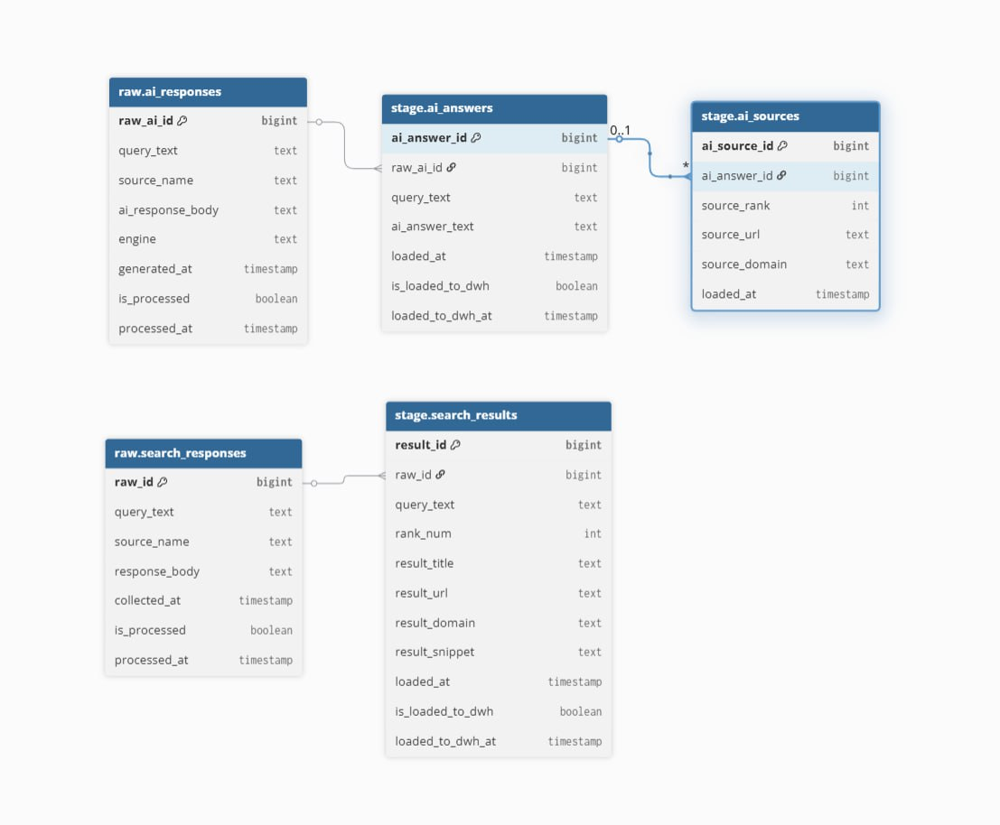

В рамках проекта был реализован полноценный DWH, основанный на методологии Кимбала с ETL для поисковой и AI-выдачи по пользовательским запросам.  
**Цель проекта** — получить структурированные данные о том, как бренды и источники представлены в классическом поиске и в AI-ответах, а затем подготовить эти данные для аналитиков в удобном виде.

Проект строился как небольшое хранилище данных с разделением на слои, историзацией фактов, витринами и аналитическими представлениями.

---

## Архитектурный подход

Для проекта была выбрана классическая многослойная архитектура хранения данных:

**Sources → Raw → Stage → DWH → Mart / Analytics**

Это решение было выбрано потому, что оно разделяет сырые и обработанные данные, упрощает контроль качества данных и позволяет сохранять исторические изменения фактов.

---

## Использованный стек
- **Python:**
	- Выбран как основной язык, потому что он позволяет быстро реализовать  интеграцию с API, работу с JSON и текстовыми файлами, преобразованием данных и оркестрацией.
- **PostgreSQL** - основная платформа хранения данных и реализации DWH-модели (фактов, измерений и витрин).
- **DBeaver**.
### Интеграции и API
- **Search API** - для получения поисковой выдачи по запросам;
- **Yandex GPT API** - для генерации AI-ответов;
### Модель поставки данных
- batch ingestion;
- оркестрация шагов через Python-скрипт;
- SQL-логика для представлений и витрин;
- работа с полным и инкрементальным прогоном.

---

## Логическая структура проекта

В проекте использовалось несколько схем.

### 1. Raw
_Слой сырых данных._

Туда попадали результаты интеграции практически без сложной бизнес-обработки ("сырые" данные).

### 2. Stage
_Промежуточный слой подготовки._

Здесь данные очищались, нормализовались и приводились к единому формату перед загрузкой в слой DWH.

### 3. DWH
_Основной слой хранения фактов и измерений._

Здесь находятся основные **fact-таблицы** (результаты поиска, AI-ответы, упоминания брендов), а также измерения и справочные сущности, необходимые для исторического и повторяемого анализа.

### 4. Mart
_Витринный слой._

Здесь размещались представления и агрегаты, понятные аналитикам. Реализовывались при помощи view, а не как отдельные таблицы.

### 5. Analytics
_Слой готовых аналитических представлений._

Этот слой реализован для хранения представлений, созданных по тз аналитиков, с посчитанными метриками и т.п. 

---

## Какой тип моделирования использовался

Проект не строился как сложный, корпоративный DWH уровня enterprise, но логика была близка к **Kimball-подходу**:

- факты и измерения формировались под аналитические задачи;
- витрины делались как точка потребления для аналитиков;
- модель проектировалась от задач анализа, а не как абстрактный глобальный корпоративный слой.

При этом архитектурно был сохранён и “инмоновский” принцип разделения слоёв, потому что для качества разработки было важно разделить raw, stage и business-ready слой.

---

## Поток данных

### Шаг 1. Подготовка списка запросов
На входе использовались текстовые файлы со списками запросов.

_На данном этапе необходимо было определиться с extract-логикой для генеративных и поисковых запросов, так как использование Yandex API не бесплатно, поэтому необходимо было прийти к минимуму вложений._
### Шаг 2. Сбор поисковой выдачи
Для каждого search query выполнялся вызов Search API.

Из ответа извлекались:
- query;
- позиция результата;
- title;
- snippet;
- URL / домен / источник;
- дополнительные атрибуты результата.

Данные сохранялись в raw, затем проходили через stage и загружались в DWH.

### Шаг 3. Сбор AI-ответов
Для части запросов вызывался Yandex GPT API.

Здесь проектировалась логика:
- получения AI-ответа;
- сохранения текста ответа;
- выделения источников, если они возвращались;
- привязки ответа к запросу.

AI-часть считалась более дорогой, поэтому её запускали на ограниченном подмножестве запросов.

### Шаг 4. Выделение брендов и упоминаний
После загрузки поисковых результатов и AI-ответов выполнялась логика анализа:
- поиск упоминаний брендов;
- сопоставление текста результата или ответа с набором брендов;
- фиксация найденных совпадений в фактовых таблицах или специальных аналитических сущностях.

### Шаг 5. Построение витрин и view
После загрузки фактов создавались:
- представления для аналитиков;
- агрегаты по частоте упоминаний;
- coverage view;
- источники по search и AI;
- сводные аналитические представления.

---

## Как работали с API

### Search API
Search API использовался для получения поисковой выдачи по пользовательским запросам.

Типовой процесс:
1. Берётся запрос из списка;
2. Выполняется HTTP-вызов;
3. Ответ разбирается;
4. Извлекаются результаты поиска;
5. Каждый результат преобразуется в табличную структуру;
6. Данные сохраняются в raw.

### Yandex GPT API
Yandex GPT API использовался для генерации ответов на пользовательские запросы.

Для работы с ним понадобилось:
- получить `folder_id`;
- настроить `api_key`;
- настроить клиент;
- протестировать соединение;
- обработать ошибки авторизации и сетевые ошибки.

_Практически отдельно от основной трансформационной логики был настроен модуль-клиент для обращения к Yandex GPT._

---

## Структура скриптов

### 1. Ingestion-скрипты
Отвечали за:
- чтение списка запросов;
- вызовы Search API;
- вызовы Yandex GPT API;
- сохранение сырых ответов.

### 2. Transform-скрипты
Отвечали за:
- очистку данных;
- нормализацию полей;
- перенос из raw в stage;
- загрузку из stage в DWH.

### 3. Analysis-скрипты
Отвечали за:
- поиск brand mentions;
- расчёт coverage;
- подготовку аналитических view;
- агрегации по источникам и позициям.

### 4. Orchestrator
Отдельный оркестратор запускал шаги по порядку.

---

## Оркестрация

Пайплайн запускался через Python-оркестратор, который последовательно вызывал модули проекта.
Данный способ является лучшим выбором для проекта такого уровня.  

Это важно, потому что для DWH повторная полная очистка не всегда корректна, если нужно сохранять историю.  
Поэтому логика полной очистки допустима только для controlled rebuild-сценариев, а для обычной эксплуатации лучше использовать инкрементальную загрузку.
